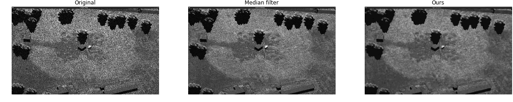

# Bayesian image denoising

This project uses Markov-chain Monte Carlo (MCMC) methods to sample from a prior distribution of images in order to perform denoising on images. The algorithms perform well on images with *speckle* noise as well as *salt & pepper* noise.

This project is built up of two C++ classes, `Ising` and `Potts` for binary and grayscale images respectively. Additionally, we provide a Cython bridge that enables use directly from Python.

## Examples





## How to use

In order to use the library from Python you will need a C++ compiler along with an edition of Cython. Compile the Cython library by running the following.

```bash
python setup.py build_ext --inplace
```

This will generate the library, typically `denoising.cpython-*.so` which you can import from Python.

Now it is possible to import the library. The example below shows how to generate the image in the ultrasound example.

```python
import numpy as np
import matplotlib.pyplot as plt

from denoising import PottsMH, MPM

image = plt.imread("data/ultrasound.jpg")

potts = PottsMH(image, beta=4, sigma=np.std(image), bins=15)
denoised = MPM(potts.solve, iterations=200, images=20)

plt.imsave("ultrasound-clean.png", denoised)
```
